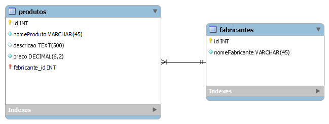
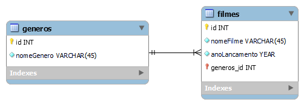

# Modelagem Lógica usando MySQL Workbench

Atividades para fins de estudos sobre banco de dados (UC8).

## Exemplo de Modelagem Lógica

## Exemplo 2 de Modelagem Lógica

## Sobre tipos de relacionamento.

### 1:1
Relacionamento do tipo **1 para 1**

### 1:n
Relacionamento do tipo **1 para n**, ou seja, **1 para vários**.

### n:m
Relacionamento do tipo **n para m**, ou seja, **vários para vários**.
