# Exercícios de Banco de Dados - Etapa 3

## Vinícius de Miranda Barbosa

## CRUD - Consultas

### 1- Faça uma consulta que mostre os alunos que nasceram antes do ano 2009

```sql
SELECT nomeAluno as Alunos,
nasc as Nascimento 
from alunos WHERE > 2009 GROUP BY Alunos;


```

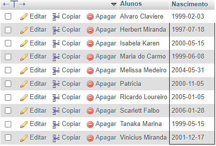

### 2- Faça uma consulta que calcule a média das notas de cada aluno e as mostre com duas casas decimais.

``` sql
SELECT nomeAluno as Aluno,
nota1 as 1° nota,
nota2 as 2° nota, 
ROUND((nota1 + nota2)/2, 2 ) AS média
FROM alunos
```
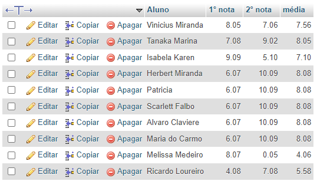

### 3- Faça uma consulta que calcule o limite de faltas de cada curso de acordo com a carga horária. Considere o limite como 25% da carga horária. Classifique em ordem crescente pelo título do curso.

```sql

SELECT cursos as Aluno,
cargaHoraria as 'Carga Horária',
ROUND((cargaHoraria * 0.25)) as 'Limite de faltas'
FROM cursos
ORDER BY cursos desc;


```
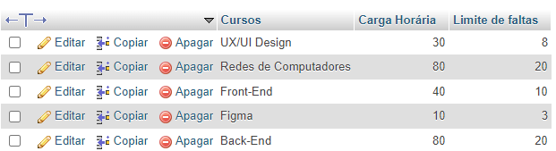

### 4- Faça uma consulta que mostre os nomes dos professores que são somente da área "desenvolvimento".

```sql

    SELECT nomeProf as Professor,
    materia as Matéria from professores WHERE materia LIKE '%desenvolvimento%';
```
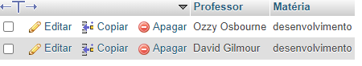


### 5-  Faça uma consulta que mostre a quantidade de professores que cada área ("design", "infra", "desenvolvimento") possui.

```sql
 
SELECT
nomeCurso as Curso, 
COUNT(professor_id) as Professores 
FROM cursos
GROUP BY Curso;

```

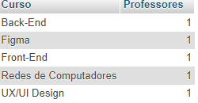


### 6- Faça uma consulta que mostre o nome dos alunos, o título e a carga horária dos cursos que fazem.


```sql

SELECT
alunos.nomeAluno as Aluno,
cursos.nomeCurso as Matéria,
cursos.cargaHoraria as "Carga Horária"
FROM alunos INNER JOIN cursos
ON alunos.curso_id = cursos.id
ORDER BY Aluno;

```
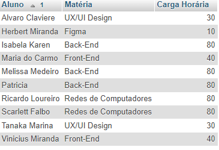

### 7- Faça uma consulta que mostre o nome dos professores e o título do curso que lecionam. Classifique pelo nome do professor.
```sql

SELECT
professores.nomeProf as Professor,
cursos.nomeCurso as Curso
FROM professores INNER JOIN cursos
ON professores.curso_id = cursos.id
ORDER BY Professor;

```
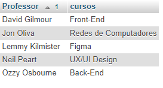

### 8- Faça uma consulta que mostre o nome dos alunos, o título dos cursos que fazem, e o professor de cada curso.


```sql

SELECT
alunos.nomeAluno as Aluno,
cursos.nomeCurso as Curso,
professores.nomeProf as Professor
FROM alunos INNER JOIN cursos 
ON alunos.curso_id = cursos.id
INNER JOIN professores
ON cursos.professor_id = professores.id    
GROUP BY Aluno;

```
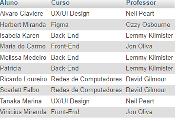


### 9- Faça uma consulta que mostre a quantidade de alunos que cada curso possui. Classifique os resultados em ordem descrecente de acordo com a quantidade de alunos.


```sql

SELECT
cursos.nomeCurso as Cursos,
COUNT(curso_id) as "Qtd. de Alunos"
FROM cursos INNER JOIN alunos
ON alunos.curso_id = cursos.id
GROUP BY Cursos
ORDER BY COUNT(alunos.curso_id) DESC;

```
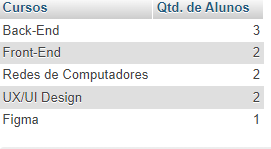

### 10- Faça uma consulta que mostre o nome dos alunos, suas notas, médias, e o título dos cursos que fazem. Devem ser considerados somente os alunos de Front-End e Back-End. Mostre os resultados classificados pelo nome do aluno.

```sql

SELECT
alunos.nomeAluno as Aluno,
nota1 as "1º Nota",
nota2 as "2° Nota",
ROUND((nota1 + nota2) / 2, 2 ) AS média,
cursos.nomeCurso as Cursos
FROM alunos INNER JOIN cursos 
ON alunos.curso_id = cursos.id
WHERE curso_id IN (1,2) GROUP BY Aluno;

```
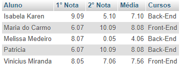

### 11- Faça uma consulta que altere o nome do curso de Figma para Adobe XD e sua carga horária de 10 para 15.
```sql

UPDATE cursos 
SET nomeCurso = "Adobe XD", cargaHoraria = "15"
WHERE id = 4;

SELECT
nomeCurso as "Curso Antigo",
'Adobe XD' as "Curso Novo",
cargaHoraria as "Carga Horária Antiga",
15 as "Carga Horária"
FROM cursos
WHERE id = 4;

```


### 12- Faça uma consulta que exclua um aluno do curso de Redes de Computadores e um aluno do curso de UX/UI.
``` sql

DELETE FROM alunos WHERE id IN (6,7);

```

### 13- Faça uma consulta que mostre a lista de alunos atualizada e o título dos cursos que fazem, classificados pelo nome do aluno.
```sql
SELECT
alunos.nomeAluno as Alunos,
cursos.nomeCurso as Cursos
FROM cursos INNER JOIN alunos
ON cursos.id = alunos.curso_id
GROUP BY Alunos;

```
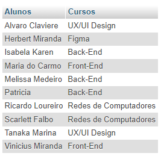


